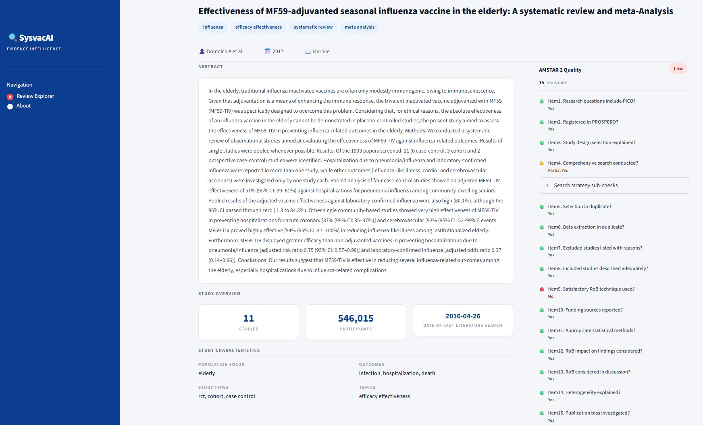

# VaxScope Inference

VaxScope Inference is an AI-assisted evidence extraction pipeline developed within the SYSVAC-AI ecosystem.

The project focuses on structured information extraction from immunization systematic reviews and meta-analyses, providing review characterization, evidence profiling, and methodological quality assessment outputs.

---

## Dashboard Preview

### Review Explorer

Browse and inspect immunization systematic reviews and extraction outputs.


### Single Review Analysis

Detailed review-level evidence extraction and AMSTAR-2 quality assessment.


## Live Demo

https://vaxscope.streamlit.app

## Features

- Review exploration interface
- Structured metadata extraction
- Disease and topic identification
- Population and outcome characterization
- Study and review type classification
- Numeric evidence extraction
  - Number of studies
  - Number of participants
  - Date of last literature search
- Evidence snippet presentation
- Automated AMSTAR-2 quality assessment
- JSON export of extracted results

---

## Repository Structure

```text
.
├── app.py
├── sample_reviews.py
├── vaxscope_inference.py
├── assets/
└── README.md
```

### Main Components

#### app.py

Streamlit dashboard for exploring review-level extraction results and AMSTAR-2 assessments.

#### vaxscope_inference.py

Inference pipeline containing:

- PubMedBERT-based classification
- Multi-label prediction
- Question-answering based slot extraction
- Rule-based validation and post-processing

#### sample_reviews.py

Curated review collection containing model-generated extraction outputs and AMSTAR-2 assessments for demonstration and exploration purposes.

---

## Example Outputs

The dashboard presents:

- Review metadata
- Structured extraction results
- Evidence snippets
- AMSTAR-2 item-level assessments
- Overall methodological quality rating

---

## Model

The inference pipeline is based on a fine-tuned PubMedBERT model for immunization review analysis.

Model checkpoint files are distributed separately due to size constraints.

---

## Inference Strategy

Classification labels are predicted from review titles and abstracts using a fine-tuned PubMedBERT model. Numeric evidence fields are extracted through a QA- and rule-based pipeline using full-text content when available.

---

## Domain

The current implementation focuses on:

- Immunization systematic reviews
- Vaccine effectiveness reviews
- Vaccine safety reviews
- Meta-analyses in vaccination research

---

## Technology Stack

- Python
- PyTorch
- Hugging Face Transformers
- Streamlit

---

## Models

- PubMedBERT (review characterization)
- RoBERTa-SQuAD2 (slot extraction)

---

## License

This repository is provided for research, and demonstration purposes.


